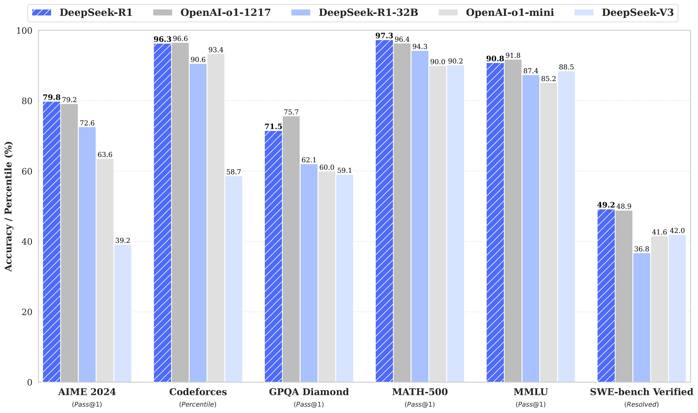

# DeepSeek-R1-Distill-Qwen-14B-GPTQ-Int4
原始模型 [deepseek-ai/DeepSeek-R1-Distill-Qwen-14B](https://www.modelscope.cn/models/deepseek-ai/DeepSeek-R1-Distill-Qwen-14B)


### 【模型更新日期】

注：通过`snapshot_download`函数传入`revision=...`来下载指定的`tag`版本

``` 
2025-01-22
1. add group 128 (tag g128)
```

### 【模型列表】

| tag     | 文件大小    | 最近更新时间       |
|---------|---------|--------------|
| `g128`  | `9.4GB` | `2025-01-22` |


### 【模型下载】

```python
from modelscope import snapshot_download
snapshot_download('tclf90/deepseek-r1-distill-qwen-14b-gptq-int4', cache_dir="本地路径", revision='g128')
```

### 【修复内容】

1. 对GPTQ量化的校准做了额外优化；减少模型的 `1.乱吐字`、`2.无限循环`、`3.长文能力丢失`等情况。
2. 根据模型实际情况，可以支持1卡、2卡及4卡的`tensor-parallel-size`启动。


### 【介绍】
## 1. Introduction

We introduce our first-generation reasoning models, DeepSeek-R1-Zero and DeepSeek-R1. 
DeepSeek-R1-Zero, a model trained via large-scale reinforcement learning (RL) without supervised fine-tuning (SFT) as a preliminary step, demonstrated remarkable performance on reasoning.
With RL, DeepSeek-R1-Zero naturally emerged with numerous powerful and interesting reasoning behaviors.
However, DeepSeek-R1-Zero encounters challenges such as endless repetition, poor readability, and language mixing. To address these issues and further enhance reasoning performance,
we introduce DeepSeek-R1, which incorporates cold-start data before RL.
DeepSeek-R1 achieves performance comparable to OpenAI-o1 across math, code, and reasoning tasks. 
To support the research community, we have open-sourced DeepSeek-R1-Zero, DeepSeek-R1, and six dense models distilled from DeepSeek-R1 based on Llama and Qwen. DeepSeek-R1-Distill-Qwen-32B outperforms OpenAI-o1-mini across various benchmarks, achieving new state-of-the-art results for dense models.

<p align="center">
  
</p>

## 2. Model Summary

---

**Post-Training: Large-Scale Reinforcement Learning on the Base Model**

-  We directly apply reinforcement learning (RL) to the base model without relying on supervised fine-tuning (SFT) as a preliminary step. This approach allows the model to explore chain-of-thought (CoT) for solving complex problems, resulting in the development of DeepSeek-R1-Zero. DeepSeek-R1-Zero demonstrates capabilities such as self-verification, reflection, and generating long CoTs, marking a significant milestone for the research community. Notably, it is the first open research to validate that reasoning capabilities of LLMs can be incentivized purely through RL, without the need for SFT. This breakthrough paves the way for future advancements in this area.

-   We introduce our pipeline to develop DeepSeek-R1. The pipeline incorporates two RL stages aimed at discovering improved reasoning patterns and aligning with human preferences, as well as two SFT stages that serve as the seed for the model's reasoning and non-reasoning capabilities.
    We believe the pipeline will benefit the industry by creating better models. 

---

**Distillation: Smaller Models Can Be Powerful Too**

-  We demonstrate that the reasoning patterns of larger models can be distilled into smaller models, resulting in better performance compared to the reasoning patterns discovered through RL on small models. The open source DeepSeek-R1, as well as its API, will benefit the research community to distill better smaller models in the future. 
- Using the reasoning data generated by DeepSeek-R1, we fine-tuned several dense models that are widely used in the research community. The evaluation results demonstrate that the distilled smaller dense models perform exceptionally well on benchmarks. We open-source distilled 1.5B, 7B, 8B, 14B, 32B, and 70B checkpoints based on Qwen2.5 and Llama3 series to the community.


### 【高并发RESTFul API推理】

方式1：[vllm](https://github.com/vllm-project/vllm)

方式2: [sglang](https://github.com/sgl-project/sglang)
